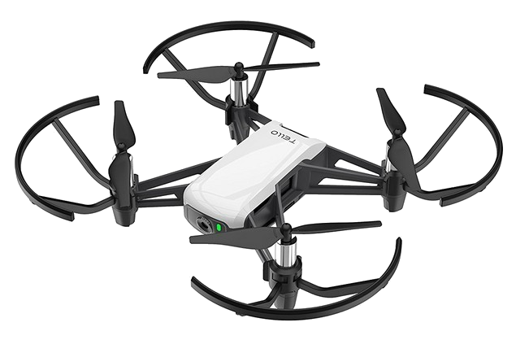
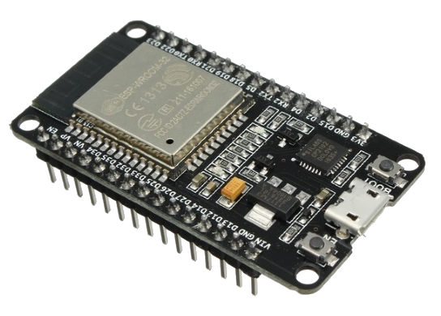
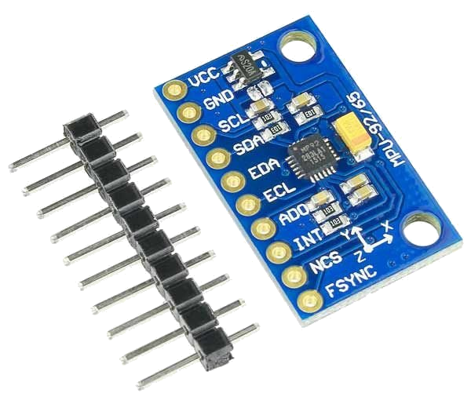

<h1>Hand-Gesture-DJI-Tello-Drone-Control</h1>

## Índice
+ [Sobre](#sobre)
+ [Primeiros Passos](#primeiros_passos)
+ [Uso](#uso)
+ [Contribuiçōes](../CONTRIBUTING.md)

<h2 id="sobre">Sobre</h2>

Escreva entre 1-2 parágrafos uma descriçāo com o propósito do seu projeto.

<h3 id="sobre-hardware">Hardware do projeto</h3>

<h4>DJI Tello Drone</h4>

<div align="center">
    
    <p>Figura x. Drone utilizado no projeto</p>
</div>

<h4>ESP32</h4>

<div align="center">
    
    <p>Figura x. Placa de desenvolvimento utilizada no projeto</p>
</div>

<h4>MPU9250</h4>

<div align="center">
    
    <p>Figura x. Sensor utilizado no projeto</p>
</div>

<h3 id="sobre-algoritmo">
    <b>Algoritmo de controle do Drone</b>
</h3>

Ideias de implementação:

- [ ] Definir limites de variação nos eixos X,Y
    - Caso a mão vire para uma direção mais que o necessário, o limite será responsável delimitar a movimentação do usuário. Esses eixos seriam responsáveis por movimentar o drone para frente, trás, esquerda e direita.
- [ ] Usar o eixo Z para capturar variações para cima e para baixo, a fim de aumentar e diminuir a altitude do drone.
- [ ] Calibrar sensores para se adaptar a qualquer um que o utilize.
    - Criar uma referência, um ponto zero quando a aplicação iniciar para se adaptar ao estilo de movimentação e posição da mão de cada pessoa que utilizar o protótipo. 
- [ ] Botão para takeoff e land
    - Botão só deve funcionar normalmente após a calibração dos sensores.
- [ ] Caso sistema dê pane, rotina para resetar e reconectar no Drone!
    - Para esse sistema, como não haveria calibração inicial o comando de land seria enviado automaticamente após a conexão, para garantir que o Drone não se descontrole.
- [ ] Botão para dar piruetas
- [ ] 

## Começando <a name = "comecando"></a>
Estas intruçōes te darão uma cópia funcional do projeto na sua máquina local para desenvolvimento e testes. Veja [deployment](#deployment) para uma descrição de como realizar o deployment deste projeto online.

### Pré-requisitos

Descreva o que é necessário para instalar este software e como instalá-lo.

```
Dê exemplos
```

### Instalação

Passo-a-passo com exemplos que reproduzam um estágio de desenvolvimento funcional.

Descreva o passo a ser tomado

```
Dê um exemplo
```

Repita

```
Até terminar
```

## Uso <a name="uso"></a>
Descreva como utilizar seu app ou sistema.